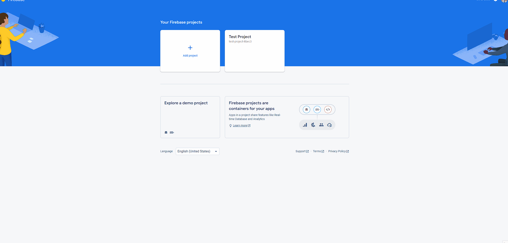
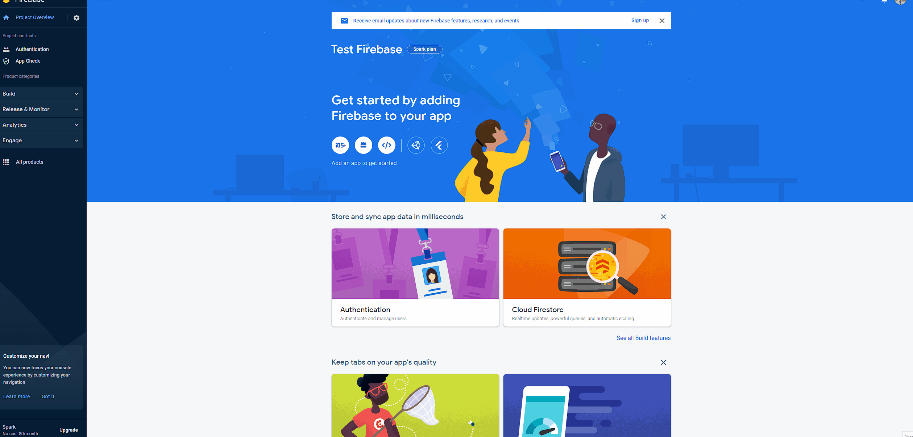

# Simple Start Firebase Authentication
This is a wrapper over "FirebaseAmin" that makes it easier to implement firebase auth in your server application.

## Features
- simplifies the process to authenticate with firebase in your web api
- supports sending emails for pasword resets and registration using Send Grid
- Currently only supports Email Sign In. We will support other sign in providers soon!
- supports roles in the Custom Claims

## Dependencies
- FirebaseAdmin (the official firebase admin sdk provided by Google)
- Fluent Email (used to send password recovery emails)
    - NOTE: only supports sendgrid api, later we will support smtp as well.
- Microsoft.AspNetCore.Authentication.JwtBearer (used to add authentication and dependency injection)

## Install
```bash
dotnet add package SimpleStart.Auth.Firebase --version 0.2.0
```

## Getting Started

### Setup Firebase
1. Create a firebase project in the Google Console 
	
2. Generate a private key json file


#### Move private key json data into App settings
The private key json file contains json information. Copy those fields and place them into your appsettings.json
```json
"type": "service_account",
"project_id": "PROJECT ID",
"private_key_id": "12345456",
"private_key": "PRIVATE KEY HERE",
"client_email": "CLIENT EMAIL",
"client_id": "CLIENT ID",
"auth_uri": "https://accounts.google.com/o/oauth2/auth",
"token_uri": "https://oauth2.googleapis.com/token",
"auth_provider_x509_cert_url": "https://www.googleapis.com/oauth2/v1/certs",
"client_x509_cert_url": "CERT URL",
"Firebase_Api_Key": "API KEY"
```

### Setup Asp Net Core Application
The example below uses Minimal Apis in Dot Net 7


#### Setup Authentication

This will use firebase for authentication and will register all the necessary services
```csharp
builder.Services.AddFirebaseAuthentication(); //use this for authentication
builder.Services.AddAuthorization();
```

#### Create Root Admin
```csharp
app.MapGet("/createadmin", async ([FromServices] FirebaseUserManager firebaseManager) =>
{
    await firebaseManager.TryCreateRootAdmin("admin@example.com", "secretPassword");
    Results.Ok();
    
}).AllowAnonymous();
```

#### Register user
```csharp
app.MapGet("/registerUser", async ([FromServices] FirebaseUserManager firebaseManager) =>
{
    var user = new FirebaseUser
    {
        Email = "user@example.com",
        DisplayName = "User 1",
        PhotoUrl = "http://www.example.com/12345678/photo.png",
        EmailVerified = true,
        Disabled = false,
        PhoneNumber = "+12345678900"
    };

    await firebaseManager.RegisterUserAsync(user,"secretpassword");
    Results.Ok();
    
}).AllowAnonymous();
```

#### Get AuthUser from Claims
```csharp
app.MapGet("/firebaseUser", async (HttpContext context) =>
{
    //Get a FirebaseUser from the claims
    var authUser = context.GetAuthUserFromClaims();

    Console.WriteLine(authUser.AppUserId);
    Console.WriteLine(authUser.AuthTime);
    Console.WriteLine(authUser.CustomClaims);
    Console.WriteLine(authUser.Disabled);
    Console.WriteLine(authUser.DisplayName);
    Console.WriteLine(authUser.Email);
    Console.WriteLine(authUser.EmailVerified);
    Console.WriteLine(authUser.Id);
    Console.WriteLine(authUser.PhoneNumber);
    Console.WriteLine(authUser.PhotoUrl);
    Console.WriteLine(authUser.Roles);

}).RequireAuthorization();
```

#### Get Password Reset Link
```csharp
app.MapGet("/passwordreset", async ([FromServices] FirebaseUserManager firebaseManager, string email) =>
{
    var link = await firebaseManager.GetPasswordResetLinkAsync(email);

    Results.Ok(link);
});
```

#### Retrieve Firebase User
```csharp
app.MapGet("/getuser", async (HttpContext context, [FromServices] FirebaseUserManager firebaseManager) =>
{
    var getUserByEmail = await firebaseManager.GetAuthUserByEmailAsync("user@example.com");
    var getUserById = await firebaseManager.GetAuthUserByIdAsync("abcd-1234");

    var getAuthenticatedUserFromContext = context.GetAuthUserFromClaims();

    Results.Ok();
});
```

#### Revoke Token
```csharp
app.MapGet("/RevokeToken", async (HttpContext context, [FromServices] FirebaseUserManager firebaseManager, string userId) =>
{
    await firebaseManager.RevokeAllTokensAsync(userId);

    Results.Ok();
});
```

#### Update Firebase User
```csharp
app.MapGet("/update", async ([FromServices] FirebaseUserManager firebaseManager, string userId) =>
{
    //update email
    await firebaseManager.UpdateEmailAsync(userId, "newemail@example.com");

    //update Disabled
    await firebaseManager.UpdateDisabledAsync(userId, true);

    //update Display name
    await firebaseManager.UpdateDisplayNameAsync(userId, "New Display name");

    //update Photo Url
    await firebaseManager.UpdatePhotoUrlAsync(userId, "http://example.com/newimage.png");

    //update Password
    await firebaseManager.UpdatePasswordAsync(userId, "newpassword");

    //updates all fields of the user.
    //Note: this will replace all fields, so if you pass an empty string, the value will be empty
    var user = new FirebaseUser
    {
        Email = "user2@example.com",
        DisplayName = "User 2",
        PhotoUrl = "http://www.example.com/12345678/photo.png",
        EmailVerified = true,
        Disabled = false, //allows the user login to firebase auth
        PhoneNumber = "+12345678900"
    };
    await firebaseManager.UpdateUserAsync(user);

    Results.Ok();
});
```

### Other Configurations

Configuring Email in app settings using SendGrid
```json
"FirebaseAuthConfig": {
    "FromEmail": "test@example.com",
    "FromName": "Application Name",
    "SendGridKey": "12345656",
    "RegisterSubjectLine": "Registeration Confirmation",
    "ResetPasswordSubjectLine": "Password Reset"
  }
```

make sure to pass the Configuration to FirebaseAuthentication
```csharp
//email config from appsettings
builder.Services.AddFirebaseAuthentication(builder.Configuration);

//or you can pass the values in as parameters
builder.Services.AddFirebaseAuthentication("test@example.com","1234-asdfasd","Test Name", "Registered Subject", "Password Email Subject");

```
