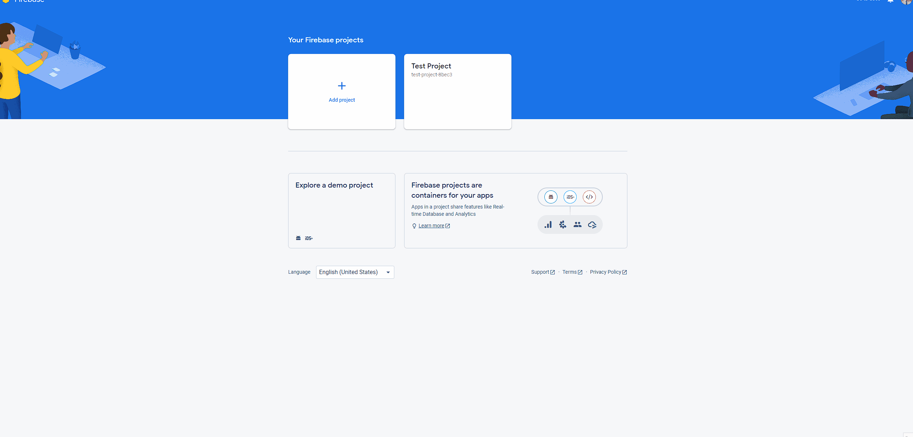
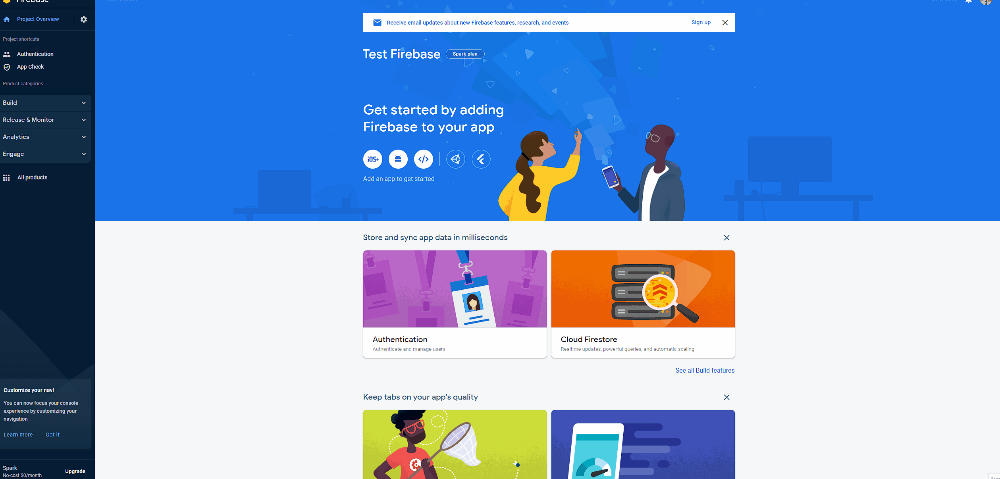

# Simple Start Firebase Authentication
This is a wrapper over "FirebaseAmin" but its simplified to implement for your asp net core applications.

## Dependencies
- FirebaseAdmin (the official firebase admin sdk provided by Google)
- Fluent Email (used to send password recovery)
- Microsoft.AspNetCore.Authentication.JwtBearer (used to add authentication and dependency injection)

## Getting Started

### Setup Firebase
1. Create a firebase project in the Google Console 
	
2. Generate a private key json file

3. Rename file something like "firebase-config.json". This file will go in the root of your Asp net Core application

### Setup Asp Net Core Application
The example below uses Minimal Apis in Dot Net 7

#### Make sure you have an environment variable set in your launchsettings
you need to add "GOOGLE_APPLICATION_CREDENTIALS": "./firebase-config.json" if the private key file is in your root.
```json
"myproject": {
      "commandName": "Project",
      "dotnetRunMessages": true,
      "launchBrowser": true,
      "launchUrl": "swagger",
      "applicationUrl": "https://localhost:7214;http://localhost:5198",
      "environmentVariables": {
        "ASPNETCORE_ENVIRONMENT": "Development",
        "GOOGLE_APPLICATION_CREDENTIALS": "./firebase-config.json"
      }
    }
```


#### Setup Authentication

This will use firebase for authentication and will register all the necessary services
```csharp
builder.Services.AddFirebaseAuthentication(); //use this for authentication
builder.Services.AddAuthorization();
```

#### Create Root Admin
```csharp
app.MapGet("/createadmin", async ([FromServices] FirebaseUserStore userStore) =>
{
    await userStore.TryCreateRootAdmin("admin@example.com", "secretPassword");
    Results.Ok();
    
}).AllowAnonymous();
```

#### Register user
```csharp
app.MapGet("/registerUser", async ([FromServices] FirebaseUserStore userStore) =>
{
    var user = new FirebaseUser
    {
        Email = "user@example.com",
        DisplayName = "User 1",
        PhotoUrl = "http://www.example.com/12345678/photo.png",
        EmailVerified = true,
        Disabled = false,
        PhoneNumber = "+12345678900"
    };

    await userStore.RegisterUserAsync(user,"secretpassword");
    Results.Ok();
    
}).AllowAnonymous();
```

#### Get Password Reset Link
```csharp
app.MapGet("/passwordreset", async ([FromServices] FirebaseUserStore userStore, string email) =>
{
    var link = await userStore.GetPasswordResetLinkAsync(email);

    Results.Ok(link);
});
```

#### Retrieve Firebase User
```csharp
app.MapGet("/getuser", async (HttpContext context, [FromServices] FirebaseUserStore userStore) =>
{
    var getUserByEmail = await userStore.GetAuthUserByEmailAsync("user@example.com");
    var getUserById = await userStore.GetAuthUserByIdAsync("abcd-1234");

    var getAuthenticatedUserFromContext = context.GetFirebaseUser();

    Results.Ok();
});
```

#### Revoke Token
```csharp
app.MapGet("/RevokeToken", async (HttpContext context, [FromServices] FirebaseUserStore userStore, string userId) =>
{
    await userStore.RevokeAllTokensAsync(userId);

    Results.Ok();
});
```

#### Update Firebase User
```csharp
app.MapGet("/update", async ([FromServices] FirebaseUserStore userStore, string userId) =>
{
    //update email
    await userStore.UpdateEmailAsync(userId, "newemail@example.com");

    //update Disabled
    await userStore.UpdateDisabledAsync(userId, true);

    //update Display name
    await userStore.UpdateDisplayNameAsync(userId, "New Display name");

    //update Photo Url
    await userStore.UpdatePhotoUrlAsync(userId, "http://example.com/newimage.png");

    //update Password
    await userStore.UpdatePasswordAsync(userId, "newpassword");

    //updates all fields of the user.
    //Note: this will replace all fields, so if you pass an empty string, the value will be empty
    var user = new FirebaseUser
    {
        Email = "user2@example.com",
        DisplayName = "User 2",
        PhotoUrl = "http://www.example.com/12345678/photo.png",
        EmailVerified = true,
        Disabled = false, //allows the user login to firebase auth
        PhoneNumber = "+12345678900"
    };
    await userStore.UpdateUserAsync(user);

    Results.Ok();
});
```

### Other Configurations

Configuring Email in app settings using SendGrid
```json
"FirebaseAuthConfig": {
    "FromEmail": "test@example.com",
    "FromName": "Application Name",
    "SendGridKey": "12345656",
    "RegisterSubjectLine": "Registeration Confirmation",
    "ResetPasswordSubjectLine": "Password Reset"
  }
```

make sure to pass the Configuration to FirebaseAuthentication
```csharp
//email config from appsettings
builder.Services.AddFirebaseAuthentication(builder.Configuration);

//or you can pass the values in as parameters
builder.Services.AddFirebaseAuthentication("test@example.com","1234-asdfasd","Test Name", "Registered Subject", "Password Email Subject");

```
